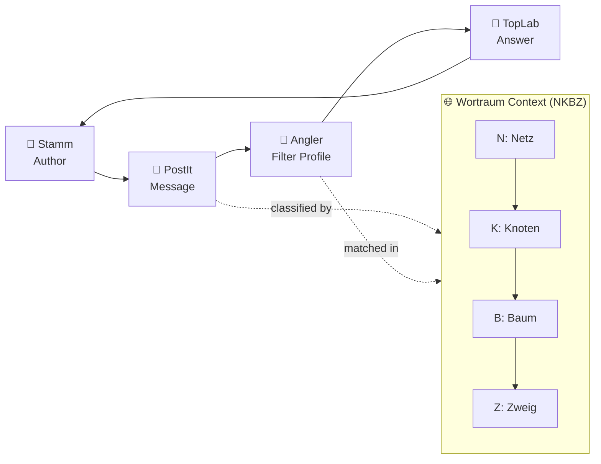
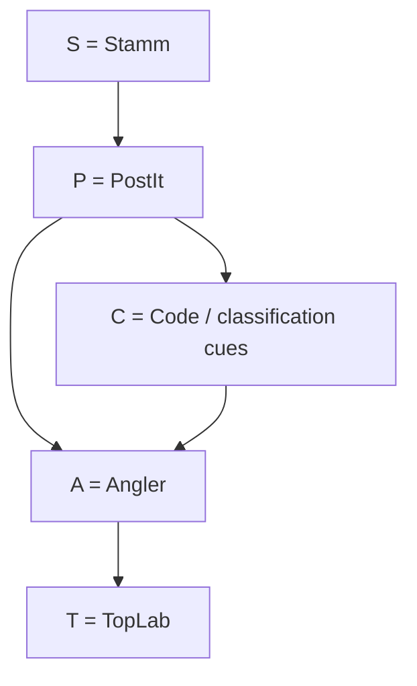

# Design Overview Page

This folder documents the narrative and visual flow behind the `/design-overview` page.

## Full Story

In OLI-it, a **Stamm** (author) creates a **PostIt** (message).  
The message is scanned and matched by **Angler** (filter profiles).  
A receiver answers with **TopLab** (response).  
This answer can trigger new communication and continues the **Kreislauf** (circuit).

The semantic context around matching and interpretation is anchored in **Wortraum** structures
(`Netz`, `Knoten`, `Zweig`) and design class groups (`SAPCT`, `NKPZ`) used for conceptual framing.

## Kreislauf + Wortraum (Mermaid)

## SAPCT roles (concept view)

## Assets in this folder

- `design-overview-diagrams.jpg` - exported visual (charts/comics/diagram snapshot)
- `architecture.drawio` - editable architecture source for future updates
