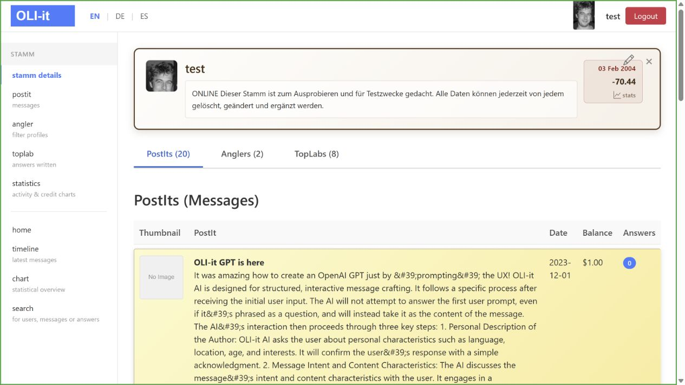
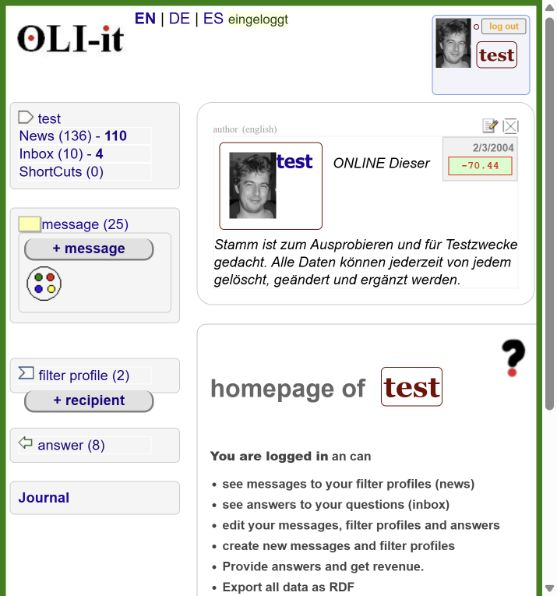

# Access baseline — 2026-10-03

Status: draft  
Environment: owner-supplied test sites; desktop browser; English home pages

## Scope and result

Opened both sites and attempted sign-in with the owner-supplied test account. No account, message or answer was created. Deployed commits and database relationships were not inspected.

| Step | Legacy | Modern |
|---|---|---|
| Open home | Reachable; anonymous navigation and a random message/answer example visible | Reachable; anonymous navigation includes Wortraum |
| Submit sign-in | Redirected to `/Sites/StammSite.aspx`; HTTP 502 gateway error shown | Reached the Stamm profile; account label and Logout control confirm sign-in |
| Authenticated workflows | Not verified | Navigation for PostIt, Angler, TopLab and statistics visible; workflows not yet exercised |

Browser-control timeouts occurred during both sign-in transitions. Later inspection confirmed the modern login succeeded and the legacy page displayed 502. One legacy reload was attempted, but its observation timed out; recovery is not verified. This is not evidence of invalid credentials or a diagnosis of the underlying server problem.

## Initial observations

- Modern profile headings show 20 PostIts, 2 Anglers and 8 TopLabs. These are UI observations, not database validation.
- Some modern message excerpts expose HTML entities and literal markup. Examples include `&#39;`, `&quot;` and `<i>`. Rendering intent and safe treatment of historical content need a focused comparison.
- The modern profile's image accessibility text reports an image-not-found condition for one PostIt. Verify storage availability and actual visual behavior before assigning a cause.
- Legacy home presents a random message with an answer; that example is absent from the observed modern home. Decide together whether it helps explain the product before treating it as a required parity item.

## Evidence

The screenshot is local review material. Review account content and publication suitability before pushing it to the public repository.

## Next walkthrough

Establish legacy authenticated access, then compare the same account's navigation and one existing message. Follow with a jointly chosen test PostIt, its Code markings, a recipient Angler and a TopLab. Confirm whether the slots share a database and whether writes trigger notifications before interpreting the cycle.

## Later retry — legacy login succeeds

On a later retry on 2026-10-03, opened the legacy home in a new browser tab and submitted the supplied test account credentials. `/Sites/StammSite.aspx` loaded successfully, showing `test`, a log out control and “You are logged in”. The earlier 502 did not recur in this attempt; its cause remains unknown.

The authenticated navigation shows News, Inbox, ShortCuts, messages, filter profiles and answers. Counts shown are 25 messages, 2 filter profiles and 8 answers. The modern baseline showed 20 PostIts; count semantics and dataset differences remain unverified. No records were created or edited.

Legacy access is now established. The next walkthrough can compare navigation and an existing message in both applications.
