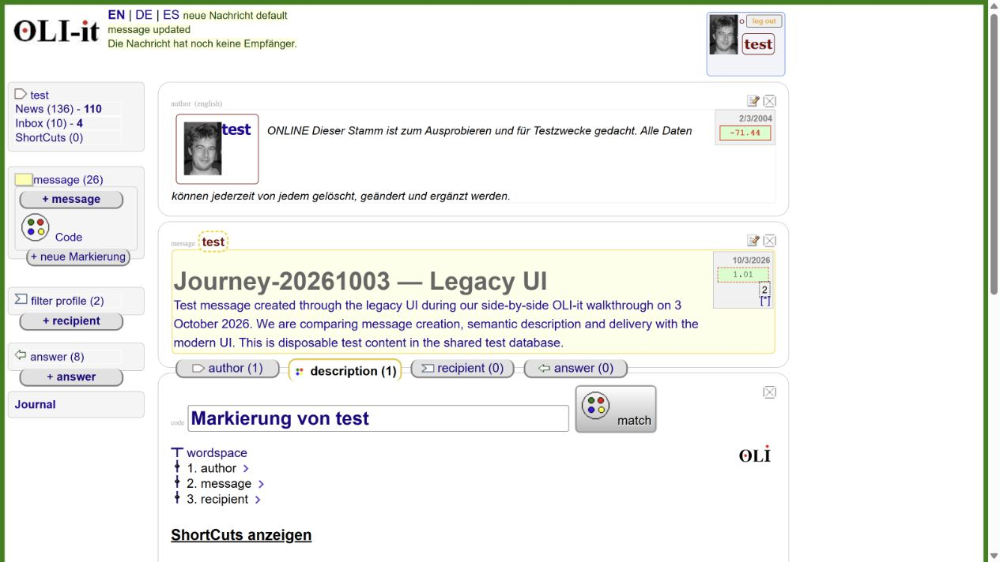
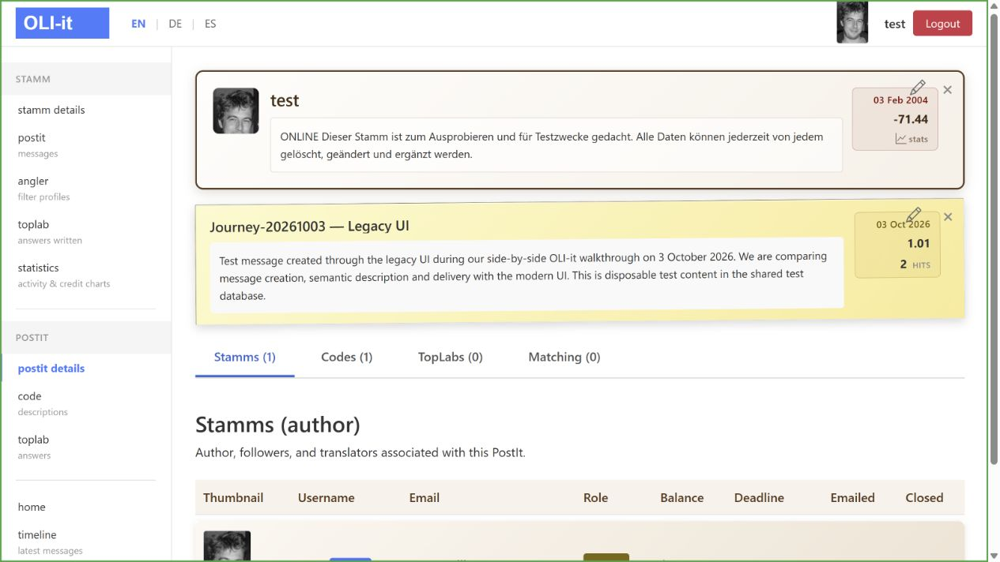

# Message creation through both UIs — 2026-10-03

Status: draft  
Scope: test account, owner-authorized message creation; no semantic markings or manual matching

The owner confirms both test applications share the same database and asks for titles indicating the creating UI. Planned titles: `Journey-20261003 — Legacy UI` and `Journey-20261003 — Modern UI`.

## Legacy: creation verified

1. Sign in, then select `+ message`.
2. In PostItMaker, enter the legacy title and this body:

   > Test message created through the legacy UI during our side-by-side OLI-it walkthrough on 3 October 2026. We are comparing message creation, semantic description and delivery with the modern UI. This is disposable test content in the shared test database.

3. Select `hinzufügen` (add), leaving other wizard settings at defaults.
4. The application opens CodeSite, shows `message updated`, the saved title and body, one description and zero recipients. Message count changes from 25 to 26. A default Code exists; no word-space markings were added and the `match` action was not used.

PostIt ID: `5456bfb3-8eeb-4a84-854c-2d556c1032a8`. Code ID: `d3f8f94c-6958-4156-9a76-f4cf1ad6af52`.

- [Legacy message](https://oliweb-test.azurewebsites.net/P/5456bfb3-8eeb-4a84-854c-2d556c1032a8.aspx)
- [Same message in modern UI](https://oliitrazorweb-test.azurewebsites.net/postit/5456bfb3-8eeb-4a84-854c-2d556c1032a8)

The default operation changes displayed test account credit from -70.44 to -71.44. The modern message view shows author balance $1.00 and deadline 2026-10-13. These are observed test UI values; no real payment was made or financial service used.

## Modern: creation blocked by a feature gap

Signed in and inspected the Stamm profile, dedicated PostIt list, home and new message detail. None exposes a new-message control. The existing message exposes `Edit PostIt`.

Local source evidence:

- `Pages/PostIt/Edit.cshtml` declares `/postit/edit/{id:guid?}`.
- Its GET and POST handlers in `Edit.cshtml.cs` return NotFound when the ID is absent, and load an existing PostIt. They implement updates, not creation.
- A focused search of the application found no PostIt insertion or creation handler. Local source does not establish the deployed commit, but agrees with the observed navigation.
- One direct browser check of `/postit/edit` failed with `ERR_BLOCKED_BY_CLIENT`; this alone does not establish a server response or status code.

No second PostIt was created. Editing or renaming the legacy-created record would not demonstrate modern creation, so the legacy title is preserved.

## Shared database observation

The new legacy PostIt is immediately readable through its modern detail route, with the same title, body and Code count. This verifies cross-UI visibility for this record, consistent with the owner's shared-database statement.

## Findings for follow-up

- Modern needs a create PostIt entry point and creation workflow before this comparison can finish. Review defaults, author linkage, Code initialization, credit/deadline effects and matching behavior against legacy before implementation.
- Modern profile initially shows 20 PostIts, while its dedicated list contains older additional records. Counts need a focused comparison; the initial count difference is not evidence of separate databases.
- Legacy creation proceeds directly into semantic description. Compare that handoff when designing the modern workflow.

Screenshots are local review evidence. Notes contain no credentials or session URLs. No implementation changes or issue creation were made in this session.
